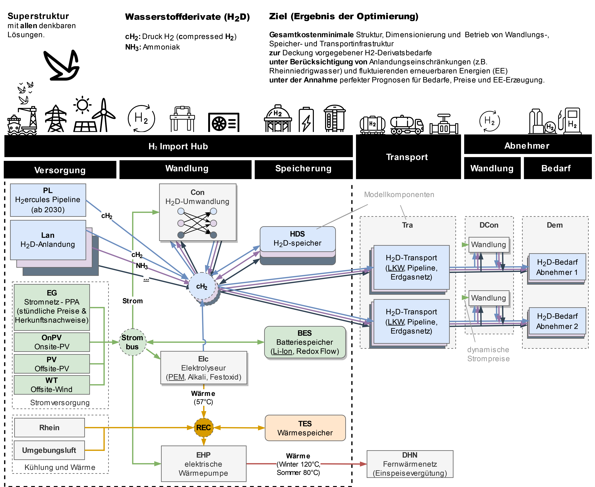

# H2iPort KA Mod öffentlicher Ordner
Open Source Code des Projekts H2iPortKaMod

[][H2iPort KA Mod]

Das Optimierungsmodell zum gleichnamigen Wasserstoffinfrastruktur-Projekt [H2iPort KA Mod], gefördert vom Land Baden-Württemberg zwischen 01.01.2023 und 30.04.2024.

## BITTE BEACHTEN
Dies ist ein öffentlich zugängliches Modell. Gemeldete Bedarfswerte, Profile, Preise und technische Details sind in diesem Model daher nicht enthalten und müssen vor der Verwendung des Codes erst ergänzt werden.

## Modell

[Infos für Modellierer](MODELING.md)

Bildnachweise

The schemes in this Project have been design by Markus Fleschutz using images from Flaticon.com:

* [Batterie icons - prettycons](https://www.flaticon.com/de/kostenlose-icons/batterie)
* [Boot icons - Freepik](https://www.flaticon.com/de/kostenlose-icons/boot)
* [Elektrolyse icons - Vectoricons](https://www.flaticon.com/de/kostenlose-icons/elektrolyse)
* [Energy icons - Dreamstale](https://www.flaticon.com/free-icons/energy)
* [Ladung icons - Freepik](https://www.flaticon.com/de/kostenlose-icons/ladung)
* [Ökologie icons - juicy_fish](https://www.flaticon.com/de/kostenlose-icons/okologie)
* [Port icons - kerismaker](https://www.flaticon.com/free-icons/port)
* [Power icons - Freepik](https://www.flaticon.com/free-icons/power)
* [River icons - kerismaker](https://www.flaticon.com/free-icons/river)
* [Ventil icons - Yogi Aprelliyanto](https://www.flaticon.com/de/kostenlose-icons/ventil)
* [Vogel icons - Freepik](https://www.flaticon.com/de/kostenlose-icons/vogel)
* [Wasserstoff icons - NeXore88](https://www.flaticon.com/de/kostenlose-icons/wasserstoff)
* [Water heater icons - Flat Icons](https://www.flaticon.com/free-icons/water-heater)
* [Windkraft icons - manshagraphics](https://www.flaticon.com/de/kostenlose-icons/windkraft)

<!-- SOURCES -->
[H2iPort KA Mod]: https://technologieregion-karlsruhe.de/energie/h2iport-ka-mod

